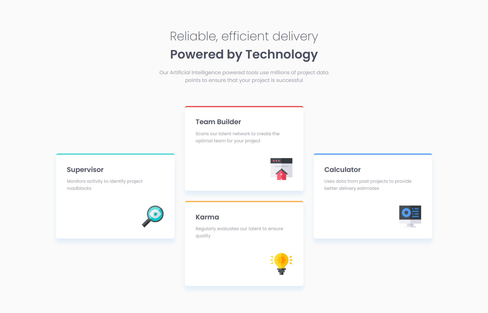
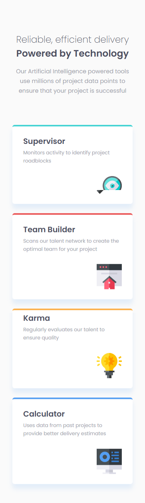

# Frontend Mentor - Four card feature section solution

This is a solution to the [Four card feature section challenge on Frontend Mentor](https://www.frontendmentor.io/challenges/four-card-feature-section-weK1eFYK). Frontend Mentor challenges help you improve your coding skills by building realistic projects. 

## Table of contents

- [Frontend Mentor - Four card feature section solution](#frontend-mentor---four-card-feature-section-solution)
  - [Table of contents](#table-of-contents)
  - [Overview](#overview)
    - [The challenge](#the-challenge)
    - [Screenshot](#screenshot)
    - [Links](#links)
  - [My process](#my-process)
    - [Built with](#built-with)
    - [What I learned](#what-i-learned)
  - [Author](#author)

## Overview

### The challenge

Users should be able to:

- View the optimal layout for the site depending on their device's screen size

### Screenshot

Desktop  


Mobile  


### Links

- Solution URL: [fm-four-card-feature-section](https://github.com/st0272/fm-four-card-feature-section)
- Live Site URL: [Four card feature section solution](https://st0272.github.io/fm-four-card-feature-section/)

## My process

### Built with

- Semantic HTML5 markup
- CSS custom properties
- Flexbox
- CSS Grid
- Mobile-first workflow

### What I learned

Responsive grid layout

```css
.card-container {
  display: grid;
  margin-block-start: 4rem;
  margin-inline: auto;
}

@media (min-width: 48.0625rem) {
  .card-container {
    width: min(calc(100% - 3.75rem), 69.375rem);
    grid-template-columns: repeat(3, 1fr);
    grid-template-rows: repeat(4, 1fr);
    gap: 1.875rem;
  }
  .card:nth-child(1) {
    grid-area: 2 / 1 / 4 / 2;
  }
  .card:nth-child(2) {
    grid-area: 1 / 2 / 3 / 3;
  }
  .card:nth-child(3) {
    grid-area: 3 / 2 / 5 / 3;
  }
  .card:nth-child(4) {
    grid-area: 2 / 3 / 4 / 4;
  }
}

@media (max-width: 48rem) {
  .card-container {
    width: 83%;
    grid-template-columns: 1fr;
    grid-template-rows: repeat(4, 1fr);
    margin-block-start: 4.75rem;
    row-gap: 1.5rem;
  }
}
```

## Author

- Website - [Suzunatsu Website](https://www.suzunatsu.com)
- Frontend Mentor - [@st0272](https://www.frontendmentor.io/profile/st0272)
- Twitter - [@suzunatsu_](https://www.twitter.com/suzunatsu_)
